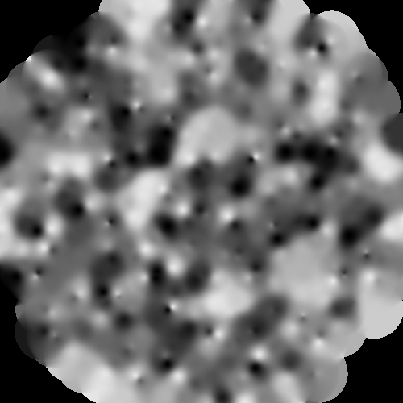

# particlemap

Data format parser and handler for particle-based data which coordinates of particles are defined as sites of Worley noise.

## How to use

Enable the feature `particlemap` in your `Cargo.toml`.

```toml
[dependencies]
worley-particle = { ..., features = ["particlemap"] }
```

## Format Specification

`x` and `y` is the sites of each particle.

```plaintext:example.particlemap
seed,min_randomness,max_randomness,scale
[{x},{y}]{other data}
...
```

### Example

```plaintext:example.particlemap
seed:150,min_randomness:0.5,max_randomness:0.8,scale:0.05
[23.8,45.2]355.7,mountain,rocky
[18.5,32.1]2.3,plain,grass
[3.2,7.8]-0.5,sea,sand
```

## Features

This library provides `ParticleMap` class to parse and handle the data.

- Read data from file
- Interpolation (Nearest, IDW)
- Rastarisation
- Vectorisation (using [contour-isobands-rs](https://crates.io/crates/contour-isobands))

## Preview




