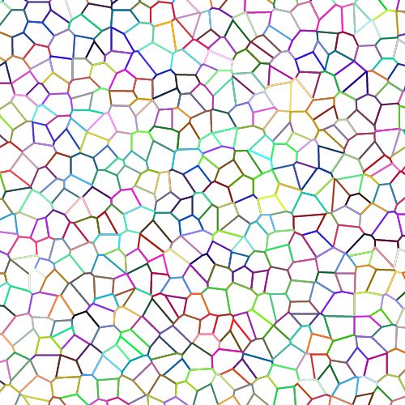

# worley-particle

Particle generator based on Worley noise.

# Features

This library does:

- Query a particle from specific point
- Generate voronoi diagram from a particle
- Change the scale and randomness of the noise

And optionally:

- [particlemap](PARTICLEMAP.md) feature: Data format parser and handler for particle-based data

# Preview

# License

License under the terms of both the [MIT license](LICENSE-MIT) and the [Apache License (Version 2.0)](LICENSE-APACHE). Choose the one that is more appropriate for you.
